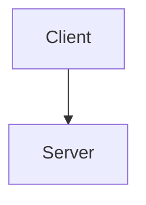

# Confluence Skill for Claude Code

Claude Code skill for managing Confluence documentation: Wiki Markup conversion, Markdown uploads, Mermaid diagram integration, and Atlassian MCP server integration.

**Key Features**: Markdown ↔ Wiki Markup conversion | Page upload/download | Mermaid diagrams | CQL search | Git sync via mark CLI

---

## Table of Contents

- [Installation](#installation)
- [Prerequisites](#prerequisites)
- [Quick Start](#quick-start)
- [Usage](#usage)
- [Features](#features)
- [Documentation](#documentation)
- [Troubleshooting](#troubleshooting)
- [Related Resources](#related-resources)

---

```bash
# Clone to your dotAgents skills directory
cd ~/Development/GitHub/dotAgents/skills/
git clone <repository-url> query-confluence

# Set SKILL_PATH for convenience
export SKILL_PATH="~/Development/GitHub/dotAgents/skills/query-confluence"
```

**Installation Levels**: Install globally (`~/.claude/skills/`), per-workspace, or per-project. Claude Code loads skills in priority: project > workspace > global.

**Multi-Instance Support**: Use separate `.mcp.json` files per workspace/project to connect to different Confluence instances with different credentials

---

## Prerequisites

### Required

1. **Atlassian MCP Server**: `npm install -g @modelcontextprotocol/server-atlassian`
2. **Confluence API Token**: Generate at https://id.atlassian.com/manage-profile/security/api-tokens
3. **MCP Configuration**: Create `.mcp.json` with credentials:

```json
{
  "mcpServers": {
    "atlassian-evinova": {
      "command": "npx",
      "args": ["-y", "@modelcontextprotocol/server-atlassian"],
      "env": {
        "CONFLUENCE_URL": "https://your-domain.atlassian.net/wiki",
        "CONFLUENCE_API_TOKEN": "your-api-token",
        "CONFLUENCE_EMAIL": "your-email@example.com"
      }
    }
  }
}
```

### Optional Tools

```bash
brew install kovetskiy/mark/mark              # Git-to-Confluence sync
npm install -g @mermaid-js/mermaid-cli        # Diagram rendering
```

---

## Quick Start

1. **Install dependencies**: `cd $SKILL_PATH/scripts && pip3 install -r requirements.txt`
2. **Configure MCP**: Create `.mcp.json` with your Confluence credentials (see Prerequisites)
3. **Start using**: Ask Claude Code natural language questions:

```
"Create a Confluence page from this Markdown in the DEV space"
"Search Confluence for pages about authentication"
"Convert this Wiki Markup to Markdown"
"Download page 450855912 to Markdown"
```

Claude Code automatically handles format conversion, diagram rendering, and API interactions.

---

## Usage

### Upload/Download Scripts

**Upload Markdown to Confluence:**
```bash
# Smart upload (reads metadata from frontmatter)
python3 $SKILL_PATH/scripts/upload_confluence_v2.py page.md

# Update specific page
python3 $SKILL_PATH/scripts/upload_confluence_v2.py page.md --id 450855912

# Dry-run preview
python3 $SKILL_PATH/scripts/upload_confluence_v2.py page.md --dry-run
```

**Download Confluence to Markdown:**
```bash
python3 $SKILL_PATH/scripts/download_confluence.py 450855912
```

**Download + Edit + Upload Workflow:**
```bash
# 1. Download with complete metadata
python3 $SKILL_PATH/scripts/download_confluence.py 450855912

# 2. Edit locally
vim Page_Title.md

# 3. Upload with zero configuration (reads frontmatter)
python3 $SKILL_PATH/scripts/upload_confluence_v2.py Page_Title.md
```

### Credential Configuration

Scripts search for credentials in order:
1. Environment variables (`CONFLUENCE_URL`, `CONFLUENCE_USERNAME`, `CONFLUENCE_API_TOKEN`)
2. `.env` / `.env.confluence` / `.env.jira` / `.env.atlassian` files
3. MCP config (`~/.config/mcp/.mcp.json`)

Example `.env`:
```bash
CONFLUENCE_URL=https://your-domain.atlassian.net
CONFLUENCE_USERNAME=your.email@example.com
CONFLUENCE_API_TOKEN=your_api_token_here
```

### Mermaid Diagrams

Mermaid diagrams are automatically rendered to SVG:
````markdown

````

Requires: `npm install -g @mermaid-js/mermaid-cli`

### Key CLI Options

```
--id PAGE_ID              # Update existing page
--space SPACE             # Space key for new pages
--parent-id PARENT_ID     # Set parent page
--ignore-frontmatter      # Ignore frontmatter parent (prevent moves)
--dry-run                 # Preview without uploading
--env-file PATH           # Custom .env file
```

**Important**: Use `--ignore-frontmatter` when restoring content to prevent inadvertent page moves. See [PARENT_RELATIONSHIP_GUIDE.md](PARENT_RELATIONSHIP_GUIDE.md).

---

## Features

- **Page Management**: Create, update, search, delete pages with CQL (Confluence Query Language)
- **Format Conversion**: Markdown ↔ Wiki Markup with nested elements, tables, code blocks
- **Diagram Integration**: Mermaid diagrams → PNG/SVG with automatic upload
- **Git Sync**: mark CLI integration for Documentation-as-Code workflows
- **Batch Operations**: Bulk page creation, label management, directory structure sync
- **Multi-Instance**: Support multiple Confluence instances via workspace-level configs

---

## Documentation

**File Structure:**
```
$SKILL_PATH/
├── SKILL.md                    # Complete workflow documentation
├── QUICK_REFERENCE.md          # Command cheat sheet
├── PARENT_RELATIONSHIP_GUIDE.md # Critical migration/restore guide
├── scripts/                    # Python utilities
│   ├── upload_confluence_v2.py
│   ├── download_confluence.py
│   └── convert_markdown_to_wiki.py
├── references/                 # Format references
│   ├── wiki_markup_guide.md
│   ├── conversion_guide.md
│   └── mark_tool_guide.md
└── examples/                   # Sample files
```

**Key Guides:**
- **[SKILL.md](SKILL.md)**: Comprehensive workflows, CQL patterns, CI/CD integration
- **[QUICK_REFERENCE.md](QUICK_REFERENCE.md)**: Common commands and examples
- **[PARENT_RELATIONSHIP_GUIDE.md](PARENT_RELATIONSHIP_GUIDE.md)**: Essential for migrations - avoid page move issues
- **[references/](references/)**: Wiki Markup syntax, conversion rules, mark CLI guide

---

## Troubleshooting

**Space not found**: Check `CONFLUENCE_SPACES_FILTER` in `.mcp.json`, verify space key case

**Permission denied**: Verify API token validity, check Confluence account permissions

**Format conversion issues**: Review `references/conversion_guide.md`, test sections separately

**Mermaid rendering fails**: Verify `mmdc --version`, test syntax at https://mermaid.live

**mark CLI sync issues**: Test with `--dry-run`, ensure `base_url` includes `/wiki` suffix

**Multiple instance issues**: Verify correct `.mcp.json` loaded for workspace/project

See [references/troubleshooting_guide.md](references/troubleshooting_guide.md) for detailed solutions.

---

## Related Resources

- [Atlassian Confluence Documentation](https://support.atlassian.com/confluence/)
- [Confluence Wiki Markup Reference](https://confluence.atlassian.com/doc/confluence-wiki-markup-251003035.html)
- [mark CLI Tool](https://github.com/kovetskiy/mark)
- [Mermaid Diagram Syntax](https://mermaid.js.org/)
- [Atlassian MCP Server](https://github.com/modelcontextprotocol/servers/tree/main/src/atlassian)
- [Model Context Protocol](https://modelcontextprotocol.io/)

---

**License**: MIT